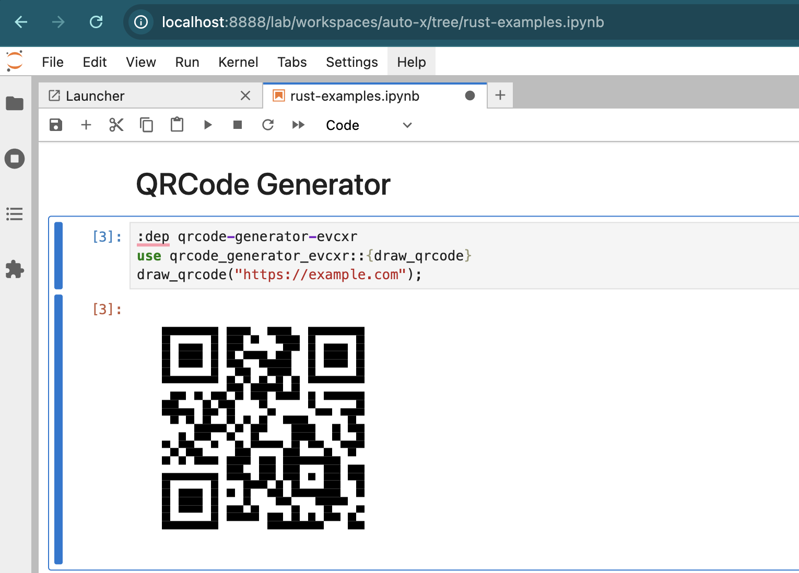

# qrcode-generator-evcxr

Display QR codes as SVG images in Jupyter notebooks via the evcxr Rust kernel.



## Usage

### Basic usage

```rust
// In a Jupyter notebook cell:
:dep qrcode-generator-evcxr
use qrcode_generator_evcxr::draw_qrcode;

draw_qrcode("https://example.com");
```

### Custom configuration

```rust
use qrcode_generator_evcxr::{draw_qrcode_with_config, QrConfig, QrCodeEcc};

let config = QrConfig {
    ec_level: QrCodeEcc::High,
    size: 512,
    margin: 2,
};
draw_qrcode_with_config("https://example.com", config);
```

### Drawing from a raw matrix

```rust
use qrcode_generator_evcxr::draw_qrcode;

let matrix = vec![
    vec![true, false, true],
    vec![false, true, false],
    vec![true, false, true],
];
draw_qrcode(matrix);
```
